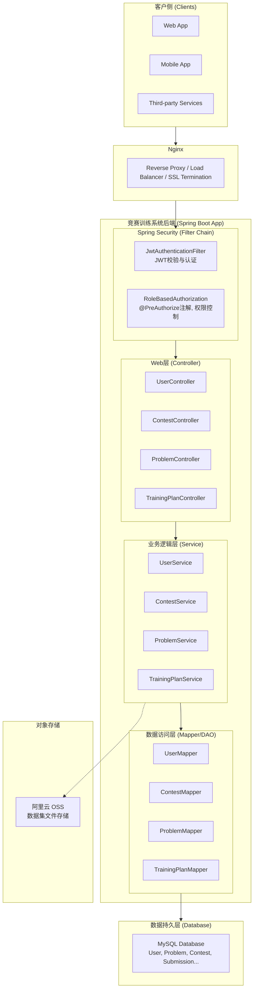
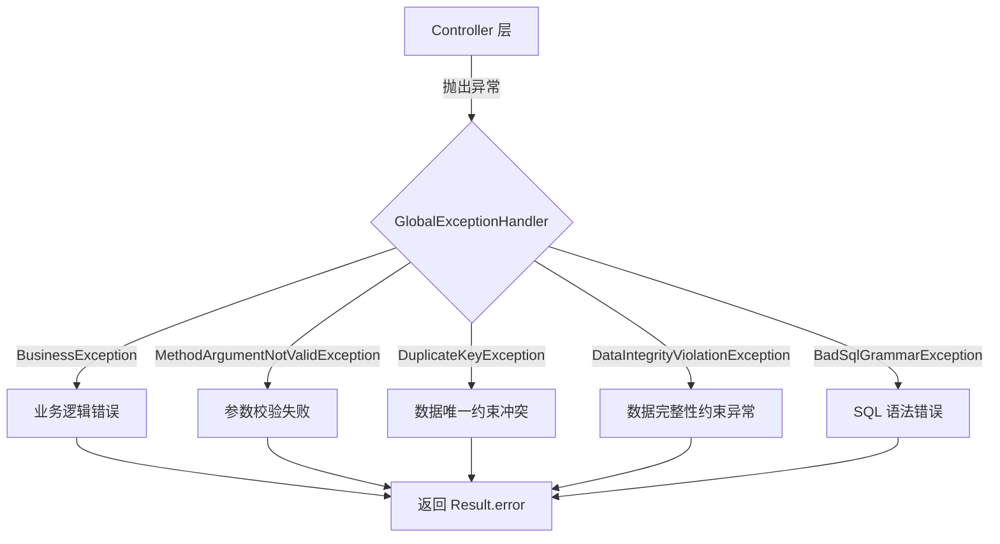
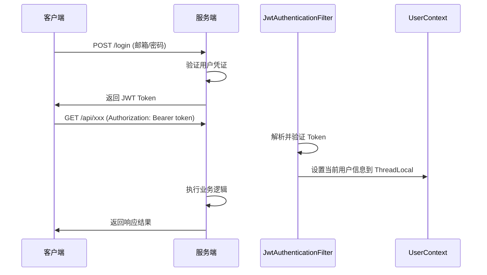

# 竞赛训练系统 - 后端服务 (Contest Training System - Backend)

---

## 1. 项目概述

本项目是 **竞赛训练系统 (Contest Training System)** 的后端服务。它是一个采用 Java 和 Spring Boot 构建的高性能、高可用的服务端应用程序，为整个平台提供核心业务逻辑、数据持久化、用户认证与授权、以及 RESTful API 接口。

### 1.1. 设计理念

- **模块化与可扩展性**: 系统被精心设计为一系列松耦合的模块（如用户、题目、竞赛、训练计划等），易于维护和扩展。
- **标准化与规范性**: 全面拥抱 RESTful 架构风格，API 设计遵循统一规范。
- **安全与稳定**: 采用基于 JWT 的无状态认证和 RBAC 权限模型，确保系统和用户数据的安全。
- **高效与性能**: 在关键业务路径上关注性能优化，确保系统在高并发场景下的稳定性。

---

## 2. 技术栈

| 技术类别             | 技术名称               | 版本/说明                            |
| :------------------- | :--------------------- | :----------------------------------- |
| **核心框架**   | Spring Boot            | 3.5.6                                |
| **Web 框架**   | Spring MVC             | 包含在 Spring Boot 中                |
| **安全框架**   | Spring Security        | 包含在 Spring Boot 中                |
| **参数校验**   | Spring Boot Validation | 包含在 Spring Boot 中                |
| **认证方案**   | JSON Web Tokens (JWT)  | jjwt 0.12.5                          |
| **持久层框架** | MyBatis                | mybatis-spring-boot-starter 3.0.3    |
| **分页插件**   | PageHelper             | pagehelper-spring-boot-starter 1.4.7 |
| **数据库**     | MySQL                  | 8.0+                                 |
| **数据库驱动** | mysql-connector-java   | 8.0.33                               |
| **对象存储**   | 阿里云 OSS             | 用于文件/数据集存储                  |
| **构建工具**   | Maven                  | 3.6+                                 |
| **开发语言**   | Java                   | 17                                   |
| **辅助工具**   | Lombok                 | 简化实体类代码                       |

---

## 3. 架构设计

### 3.1. 分层架构

本项目采用经典的三层架构模式，确保了各层职责单一、边界清晰，从而提高了代码的可读性、可维护性和可测试性。

- **表示层 (Presentation Layer)**: 由 `controller` 包下的 Spring MVC 控制器构成，作为系统的 HTTP 入口，负责接收请求、参数校验和结果封装。
- **业务逻辑层 (Business Logic Layer)**: 由 `service` 包下的服务类构成，是系统核心业务逻辑的所在地，负责编排和实现复杂的业务场景，并管理数据库事务。
- **数据访问层 (Data Access Layer)**: 由 `mapper` 包下的 MyBatis 接口及对应的 XML 文件构成，负责与数据库进行直接交互，实现数据的增、删、改、查（CRUD）。

### 3.2. 架构图



---

## 4. 项目结构

核心代码位于 `src/main/java/com/system` 目录下，并按照功能和分层架构的原则进行了组织。

```
contest_training_system
├── pom.xml                       # Maven项目配置文件
├── docs/                         # 文档目录
└── src
    └── main
        ├── java
        │   └── com
        │       └── system
        │           ├── ContestTrainingSystemApplication.java  # 应用启动入口
        │           ├── config/              # 配置类
        │           │   ├── SecurityConfig.java                # Spring Security配置
        │           │   ├── JwtAuthenticationFilter.java       # JWT认证过滤器
        │           │   └── FlexibleLocalDateTimeDeserializer.java # 日期时间反序列化
        │           ├── controller/          # 控制器层 (处理HTTP请求)
        │           │   ├── UserController.java
        │           │   ├── ContestController.java
        │           │   ├── ProblemController.java
        │           │   └── TrainingPlanController.java
        │           ├── dto/                 # 数据传输对象 (封装请求数据)
        │           ├── entity/              # 数据库实体类
        │           ├── exception/           # 全局异常处理
        │           │   ├── BusinessException.java             # 业务异常类
        │           │   └── GlobalExceptionHandler.java        # 全局异常处理器
        │           ├── mapper/              # MyBatis数据访问接口 (DAO)
        │           ├── service/             # 业务逻辑层
        │           │   ├── impl/            # 服务实现类
        │           │   └── *Service.java    # 服务接口
        │           ├── util/                # 工具类
        │           │   ├── JwtUtil.java                       # JWT工具类
        │           │   └── UserContext.java                   # 用户上下文
        │           └── vo/                  # 视图对象 (封装响应数据)
        │               ├── Result.java                        # 统一响应结果
        │               └── PageResultVO.java                  # 分页结果封装
        └── resources
            └── application.yml     # Spring Boot主配置文件
```

### 4.1. 核心类说明

| 类名                        | 说明                                                   |
| :-------------------------- | :----------------------------------------------------- |
| `Result<T>`               | 统一 API 响应格式，包含 code(1=成功,0=失败)、msg、data |
| `PageResultVO<T>`         | 分页查询结果封装，包含 total、records                  |
| `GlobalExceptionHandler`  | 全局异常处理，支持业务异常、参数校验、数据库约束等     |
| `JwtAuthenticationFilter` | JWT 认证过滤器，验证请求中的 Token                     |
| `UserContext`             | 用户上下文工具，获取当前登录用户信息                   |

---

## 5. 快速入门指南

本指南旨在帮助新加入的开发者快速搭建开发环境，并成功运行后端服务。

### 5.1. 环境要求

- **JDK**: `17` 或更高版本
- **Maven**: `3.6` 或更高版本
- **IDE**: 推荐 `IntelliJ IDEA` (Community 或 Ultimate 版均可)
- **数据库**: `MySQL 8.0` 或更高版本

### 5.2. 设置步骤

1. **克隆代码仓库**

   ```bash
   git clone <your-repository-url>
   cd ContestSystem/backend/contest_training_system
   ```
2. **配置数据库**

   - 在本地 MySQL 服务器中创建一个新的数据库。
     ```sql
     CREATE DATABASE competition_training_system CHARACTER SET utf8mb4 COLLATE utf8mb4_unicode_ci;
     ```
   - 将项目根目录 `../../sql/bakeup.sql` 文件导入到你创建的数据库中，以初始化表结构和数据。
3. **配置 `application.yml`**

   - 打开 `src/main/resources/application.yml` 文件。
   - 修改 `spring.datasource` 部分以匹配你的本地数据库设置（主要是用户名和密码）。
     ```yaml
     spring:
       datasource:
         url: jdbc:mysql://localhost:3306/competition_training_system
         username: your_mysql_username
         password: your_mysql_password
         driver-class-name: com.mysql.cj.jdbc.Driver
     ```
4. **配置 JWT 密钥**

   - **重要**: 打开 `src/main/java/com/system/util/JwtUtil.java` 并修改 `SECRET` 常量。这是一个用于签名 JWT 的密钥，必须保证其复杂性和保密性。
5. **在 IntelliJ IDEA 中打开项目**

   - 选择 `File -> Open...` 并导航到本项目的 `pom.xml` 文件或根目录。
   - IDEA 会自动识别为 Maven 项目并下载所有依赖。
6. **运行应用**

   - 在项目结构中找到 `src/main/java/com/system/ContestTrainingSystemApplication.java` 文件。
   - 右键点击该文件，选择 `Run 'ContestTrainingSystemApplication'`。
   - 如果一切顺利，控制台将显示 Spring Boot 的启动日志，表明应用已在默认端口 `8000` 上启动。
   - API 基础路径: `http://localhost:8000`

---

## 6. API 概览

所有 API 接口都返回一个统一的 `Result<T>` 对象，并对分页查询使用 `PageResultVO<T>`。详细的 API 文档请参阅 `docs/ProjectStructure.md`。

### 6.1. 用户模块 (`/user`, `/admin/users`)

- `POST /register`: 注册新用户（学生角色）。
- `POST /login`: 用户登录，返回 JWT Token。
- `POST /user/deactivate`: [认证用户] 注销当前登录用户账号。
- `GET /user/profile`: [认证用户] 获取当前登录用户的个人信息。
- `PUT /user/update`: [认证用户] 更新当前登录用户的个人信息。
- `GET /admin/users`: [管理员] 分页查询用户列表。

### 6.2. 题目模块 (`/problem`)

- `POST /problem/create`: [管理员/教师] 创建一个新题目。
- `PUT /problem/update`: [管理员/教师] 更新一个已存在的题目。
- `GET /problem/list`: 获取题目列表，支持分页和筛选。
- `GET /problem/{problemId}`: 获取单个题目的详细信息。
- `DELETE /problem/{problemId}`: [管理员] 逻辑删除一个题目。

### 6.3. 竞赛模块 (`/contest`)

- `POST /contest/create`: [管理员/教师] 创建一个新竞赛。
- `PUT /contest/update`: [管理员/教师] 更新一个已存在的竞赛。
- `DELETE /contest/{contestId}`: [管理员/教师] 删除一个竞赛。
- `GET /contest/list`: 获取竞赛列表，支持分页和筛选。
- `GET /contest/{contestId}`: 获取单个竞赛的详细信息。
  - **访问控制逻辑**：
    - **未开始的私密赛事**：学生/教师不允许查看（创建者除外），返回“当前赛事未开始”提示。
    - **私有赛事详情查看**：未参加的学生/教师需要输入正确密码（创建者和已参加者除外）。
    - **管理员**无以上限制。
  - **参数**：`password` (可选): 私有赛事密码。
- `POST /contest/join`: 用户报名参加一个竞赛。
- `POST /contest/hasJoined`: 检查用户是否已加入竞赛。

### 6.4. 训练计划模块 (`/training_plan`)

- `POST /training_plan/create`: [管理员/教师] 创建一个新训练计划。
- `PUT /training_plan/update`: [管理员/教师] 更新一个已存在的训练计划。
- `DELETE /training_plan/{planId}`: [管理员/教师] 删除一个训练计划。
- `GET /training_plan/list`: 获取训练计划列表，支持分页和筛选。
- `GET /training_plan/{planId}`: 获取单个训练计划的详细信息。

### 6.5. 题解模块 (`/problem`)

- `POST /problem/solution/create`: [教师] 发布题解。
- `PUT /problem/solution/update`: [教师] 更新题解。
- `DELETE /problem/solution/{reportId}`: [教师] 删除题解。
- `GET /problem/{problemId}/solution/list`: 获取某题的题解列表。
- `GET /problem/solution/{reportId}`: 获取题解详情。

---

## 7. 数据库表结构

以下为核心数据表，详细关系请参考 `../../sql/contest (DDL) [localhost].md`。

### 7.1. 核心业务表

| 表名              | 说明                                                         |
| :---------------- | :----------------------------------------------------------- |
| `user`          | 用户表，存储用户基本信息（邮箱、手机、昵称、学号、角色等）   |
| `problem`       | 题目表，存储题目信息（标题、描述、输入输出规范、时空限制等） |
| `contest`       | 竞赛表，存储竞赛信息（标题、时间、可见性、状态等）           |
| `training_plan` | 训练计划表，存储训练计划信息                                 |
| `submission`    | 提交记录表，存储代码提交记录和评测结果                       |

### 7.2. 关联表

| 表名                      | 说明                 |
| :------------------------ | :------------------- |
| `contest_participant`   | 竞赛参与者关联表     |
| `contest_problem`       | 竞赛题目关联表       |
| `training_plan_contest` | 训练计划与竞赛关联表 |
| `training_plan_student` | 训练计划与学生关联表 |

### 7.3. 辅助表

| 表名                     | 说明               |
| :----------------------- | :----------------- |
| `problem_dataset`      | 题目测试数据集表   |
| `solution_report`      | 题解报告表         |
| `submission_testcase`  | 提交测试用例详情表 |
| `contests_score_cache` | 竞赛成绩缓存表     |

---

## 8. 编译与启动指南

### 8.1. 本地开发环境启动

#### 8.1.1. 方式一：使用 IDE 直接运行（推荐开发调试）

在 IntelliJ IDEA 中:

1. 找到 `src/main/java/com/system/ContestTrainingSystemApplication.java`
2. 右键选择 `Run 'ContestTrainingSystemApplication'`
3. 应用将在 `http://localhost:8000` 启动

#### 8.1.2. 方式二：使用 Maven 命令运行

在项目根目录 `backend/contest_training_system/` 下执行:

```powershell
# Windows PowerShell
mvn spring-boot:run
```

```bash
# Linux/macOS
mvn spring-boot:run
```

应用将在 `http://localhost:8000` 启动,日志会直接输出到控制台。

---

### 8.2. 编译打包

#### 8.2.1. 首次编译（无 JAR 包）

在项目根目录 `backend/contest_training_system/` 下执行:

```powershell
# Windows PowerShell
mvn clean package -DskipTests
```

```bash
# Linux/macOS
mvn clean package -DskipTests
```

**说明:**

- `clean`: 清理之前的编译结果
- `package`: 打包成 JAR 文件
- `-DskipTests`: 跳过测试用例执行,加快编译速度

**编译输出:**

- JAR 文件位置: `target/contest_training_system-0.0.1-SNAPSHOT.jar`
- 编译时间: 首次编译约 2-5 分钟（取决于网络速度和机器性能）

#### 8.2.2. 重新编译（已有 JAR 包）

当代码有更新时,在项目根目录 `backend/contest_training_system/` 下重新执行:

```powershell
# Windows PowerShell
mvn clean package -DskipTests
```

```bash
# Linux/macOS
mvn clean package -DskipTests
```

旧的 JAR 文件将被新编译的文件覆盖。

---

### 8.3. 启动应用

#### 8.3.1. 本地前台运行（有 JAR 包）

在项目根目录 `backend/contest_training_system/` 下执行:

```powershell
# Windows PowerShell
java -jar target/contest_training_system-0.0.1-SNAPSHOT.jar
```

```bash
# Linux/macOS
java -jar target/contest_training_system-0.0.1-SNAPSHOT.jar
```

**特点:**

- 日志直接输出到控制台
- 按 `Ctrl+C` 可停止应用
- 适合本地调试

#### 8.3.2. 本地后台运行（有 JAR 包）

**Windows PowerShell:**

```powershell
# 启动应用并将日志输出到文件
Start-Process java -ArgumentList "-jar", "target/contest_training_system-0.0.1-SNAPSHOT.jar" -RedirectStandardOutput "logs/app.log" -RedirectStandardError "logs/error.log" -NoNewWindow

# 查看日志
Get-Content logs/app.log -Wait -Tail 50
```

**Linux/macOS:**

```bash
# 启动应用并在后台运行
nohup java -jar target/contest_training_system-0.0.1-SNAPSHOT.jar > logs/app.log 2>&1 &

# 查看日志
tail -f logs/app.log
```

**特点:**

- 后台运行,关闭终端不影响应用
- 日志保存到文件,方便查看和排查问题

---

### 8.4. 生产环境部署

#### 8.4.1. 部署准备

1. **编译打包**（在开发机器上）

   ```powershell
   # Windows
   cd backend/contest_training_system
   mvn clean package -DskipTests
   ```

   ```bash
   # Linux/macOS
   cd backend/contest_training_system
   mvn clean package -DskipTests
   ```
2. **上传到服务器**

   将 `target/contest_training_system-0.0.1-SNAPSHOT.jar` 上传到服务器。

#### 8.4.2. 生产环境启动

**Linux 服务器（推荐方式）:**

```bash
# 创建日志目录
mkdir -p logs

# 后台启动应用（生产环境配置）
nohup java -jar contest_training_system-0.0.1-SNAPSHOT.jar \
  --spring.profiles.active=prod \
  --server.port=8000 \
  > logs/app.log 2>&1 &

# 保存进程 PID
echo $! > logs/app.pid

# 查看启动日志
tail -f logs/app.log
```

**停止应用:**

```bash
# 方式一: 使用 PID 文件
kill $(cat logs/app.pid)

# 方式二: 查找进程并停止
ps aux | grep contest_training_system
kill <PID>
```

**重启应用:**

```bash
# 停止应用
kill $(cat logs/app.pid)

# 等待进程完全停止
sleep 3

# 重新启动
nohup java -jar contest_training_system-0.0.1-SNAPSHOT.jar \
  --spring.profiles.active=prod \
  > logs/app.log 2>&1 &
echo $! > logs/app.pid
```

---

### 8.5. 常用运维命令

#### 8.5.1. 查看应用状态

```bash
# Linux
ps aux | grep contest_training_system

# 查看端口占用
netstat -tuln | grep 8000
# 或
ss -tuln | grep 8000
```

```powershell
# Windows
Get-Process | Where-Object {$_.ProcessName -like "*java*"}

# 查看端口占用
netstat -ano | findstr :8000
```

#### 8.5.2. 查看日志

```bash
# Linux - 实时查看日志
tail -f logs/app.log

# 查看最近 100 行
tail -n 100 logs/app.log

# 搜索错误日志
grep -i "error" logs/app.log
```

```powershell
# Windows - 实时查看日志
Get-Content logs/app.log -Wait -Tail 50

# 查看最近 100 行
Get-Content logs/app.log -Tail 100

# 搜索错误日志
Select-String -Path logs/app.log -Pattern "error" -CaseSensitive
```

#### 8.5.3. 性能调优启动参数

```bash
# 生产环境推荐配置
java -Xms512m -Xmx1024m \
  -XX:+UseG1GC \
  -XX:MaxGCPauseMillis=200 \
  -jar contest_training_system-0.0.1-SNAPSHOT.jar \
  --spring.profiles.active=prod
```

**参数说明:**

- `-Xms512m`: 初始堆内存 512MB
- `-Xmx1024m`: 最大堆内存 1GB
- `-XX:+UseG1GC`: 使用 G1 垃圾收集器
- `-XX:MaxGCPauseMillis=200`: GC 最大停顿时间 200ms

---

### 8.6. 快速命令参考

| 场景               | Windows PowerShell                                                                                                                                   | Linux/macOS                                                                                 |
| :----------------- | :--------------------------------------------------------------------------------------------------------------------------------------------------- | :------------------------------------------------------------------------------------------ |
| **首次编译** | `mvn clean package -DskipTests`                                                                                                                    | `mvn clean package -DskipTests`                                                           |
| **开发运行** | `mvn spring-boot:run`                                                                                                                              | `mvn spring-boot:run`                                                                     |
| **前台启动** | `java -jar target/contest_training_system-0.0.1-SNAPSHOT.jar`                                                                                      | `java -jar target/contest_training_system-0.0.1-SNAPSHOT.jar`                             |
| **后台启动** | `Start-Process java -ArgumentList "-jar", "target/contest_training_system-0.0.1-SNAPSHOT.jar" -RedirectStandardOutput "logs/app.log" -NoNewWindow` | `nohup java -jar target/contest_training_system-0.0.1-SNAPSHOT.jar > logs/app.log 2>&1 &` |
| **查看日志** | `Get-Content logs/app.log -Wait -Tail 50`                                                                                                          | `tail -f logs/app.log`                                                                    |
| **停止应用** | `Stop-Process -Name java`                                                                                                                          | `kill $(cat logs/app.pid)`                                                                |

---

## 9. 配置说明

### 9.1. `application.yml` 配置项

```yaml
spring:
  application:
    name: competition_training_system

  # 数据库配置
  datasource:
    url: jdbc:mysql://localhost:3306/competition_training_system
    driver-class-name: com.mysql.cj.jdbc.Driver
    username: root
    password: your_password

  # 文件上传配置
  servlet:
    multipart:
      max-file-size: 100MB        # 单文件最大大小
      max-request-size: 105MB     # 请求最大大小

# MyBatis 配置
mybatis:
  configuration:
    log-impl: org.apache.ibatis.logging.stdout.StdOutImpl  # SQL日志输出
    map-underscore-to-camel-case: true                      # 驼峰命名映射

# 分页插件配置
pagehelper:
  reasonable: true          # 合理化分页参数
  helper-dialect: mysql     # 数据库方言

# 服务端口
server:
  port: 8000

# 阿里云 OSS 配置（用于数据集文件存储）
aliyun:
  oss:
    endpoint: https://oss-cn-hangzhou.aliyuncs.com
    bucketName: your-bucket-name
    region: cn-hangzhou
```

### 9.2. 角色权限说明

系统支持三种用户角色：

| 角色        | 权限说明                                          |
| :---------- | :------------------------------------------------ |
| `STUDENT` | 学生角色，可查看公开题目/竞赛、参加竞赛、提交代码 |
| `TEACHER` | 教师角色，可创建/管理题目、竞赛、训练计划         |
| `ADMIN`   | 管理员角色，拥有所有权限，包括用户管理            |

---

## 10. 统一响应格式

### 10.1. 成功响应

```json
{
  "code": 1,
  "msg": "success",
  "data": { ... }
}
```

### 10.2. 失败响应

```json
{
  "code": 0,
  "msg": "错误信息描述",
  "data": null
}
```

### 10.3. 分页响应

```json
{
  "code": 1,
  "msg": "success",
  "data": {
    "total": 100,
    "records": [ ... ]
  }
}
```

---

## 11. 异常处理机制

系统通过 `GlobalExceptionHandler` 实现全局异常处理，提供友好的错误提示。

### 11.1. 异常处理流程



### 11.2. 支持的异常类型

| 异常类型                            | 触发场景                      | 返回示例                               |
| :---------------------------------- | :---------------------------- | :------------------------------------- |
| `BusinessException`               | 业务逻辑校验失败              | `用户不存在`                         |
| `MethodArgumentNotValidException` | `@RequestBody` 参数校验失败 | `邮箱格式不正确; 密码不能为空`       |
| `BindException`                   | 表单参数绑定校验失败          | `字段xxx不能为空`                    |
| `ConstraintViolationException`    | `@RequestParam` 等参数校验  | `ID必须为正数`                       |
| `DuplicateKeyException`           | 数据库唯一约束冲突            | `title：【xxx】已存在，请勿重复添加` |
| `DataIntegrityViolationException` | 外键/非空/长度约束冲突        | `该竞赛已被训练计划引用，无法删除`   |

---

## 12. 安全认证机制

### 12.1. JWT 认证流程



### 12.2. 请求认证

所有需要认证的接口必须在请求头中携带 JWT Token：

```http
Authorization: Bearer <your_jwt_token>
```

### 12.3. 方法级权限控制

系统使用 Spring Security 的 `@PreAuthorize` 注解进行方法级权限控制：

```java
// 仅管理员可访问
@PreAuthorize("hasRole('ADMIN')")

// 管理员或教师可访问
@PreAuthorize("hasAnyRole('ADMIN', 'TEACHER')")

// 已认证用户可访问
@PreAuthorize("isAuthenticated()")
```

### 12.4. 公开接口

以下接口无需认证即可访问：

- `POST /register` - 用户注册
- `POST /login` - 用户登录

---

## 13. 常见问题（FAQ）

### Q1: 启动时提示数据库连接失败？

**A:** 请检查以下几点：

1. MySQL 服务是否已启动
2. `application.yml` 中的数据库连接信息是否正确
3. 数据库 `competition_training_system` 是否已创建
4. 用户名和密码是否正确

### Q2: JWT Token 失效或无效？

**A:** 可能原因：

1. Token 已过期，需要重新登录获取新 Token
2. 请求头格式不正确，确保是 `Authorization: Bearer <token>`
3. `JwtUtil.java` 中的 `SECRET` 密钥已更改

### Q3: 文件上传失败？

**A:** 请检查：

1. 文件大小是否超过 `100MB` 限制
2. 阿里云 OSS 配置是否正确
3. OSS Bucket 权限是否正确配置

### Q4: 如何开启/关闭 SQL 日志输出？

**A:** 在 `application.yml` 中已配置：

```yaml
mybatis:
  configuration:
    log-impl: org.apache.ibatis.logging.stdout.StdOutImpl
```

如需关闭，注释掉 `log-impl` 配置项即可。

---

## 14. 开发与调试

### 14.1. 本地开发配置

开发环境可临时关闭认证，修改 `SecurityConfig.java`：

```java
.authorizeHttpRequests(auth -> auth
    // 开发环境临时关闭鉴权，全部放行
    .anyRequest().permitAll()
    // 原生产配置（需要时恢复）:
    // .requestMatchers("/register", "/login").permitAll()
    // .anyRequest().authenticated()
)
```

### 14.2. 推荐开发工具

- **IDE**: IntelliJ IDEA Ultimate
- **数据库工具**: DataGrip / Navicat / DBeaver
- **API 测试**: Postman / Apifox
- **版本控制**: Git

### 14.3. 代码规范

- 遵循阿里巴巴 Java 开发手册
- 使用 Lombok 简化 POJO 类
- Controller 层只做参数校验和结果封装
- Service 层处理业务逻辑
- 统一使用 `Result<T>` 封装响应

---

## 15. 参考文档

- [Spring Boot 官方文档](https://docs.spring.io/spring-boot/docs/current/reference/html/)
- [MyBatis 官方文档](https://mybatis.org/mybatis-3/zh/index.html)
- [Spring Security 官方文档](https://docs.spring.io/spring-security/reference/index.html)
- [阿里云 OSS SDK 文档](https://help.aliyun.com/document_detail/32009.html)
- [PageHelper 分页插件文档](https://github.com/pagehelper/Mybatis-PageHelper)
